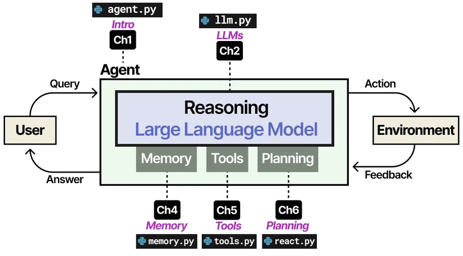
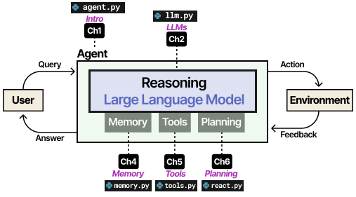
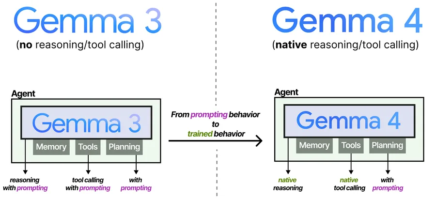
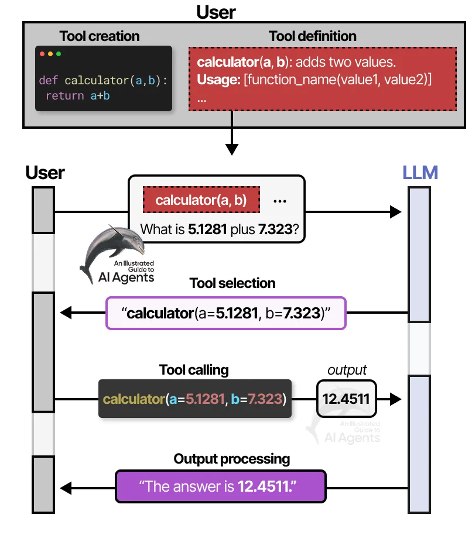
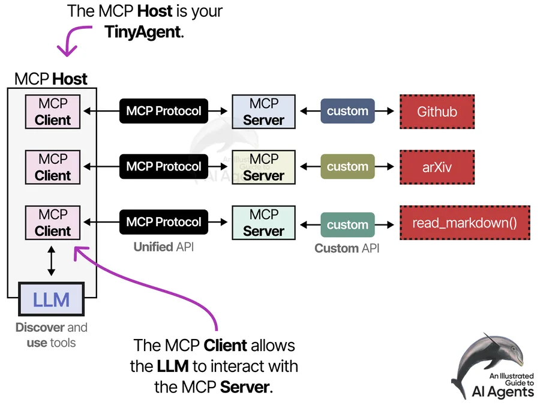
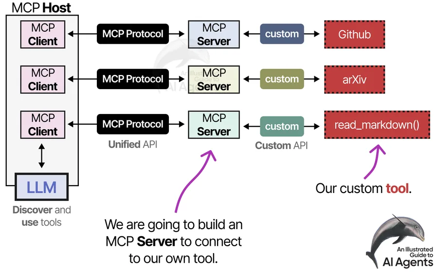
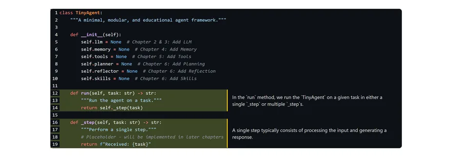
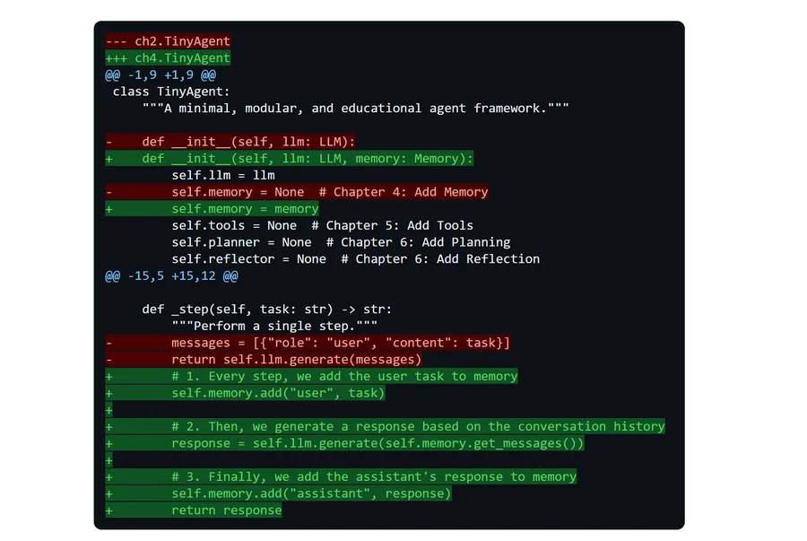
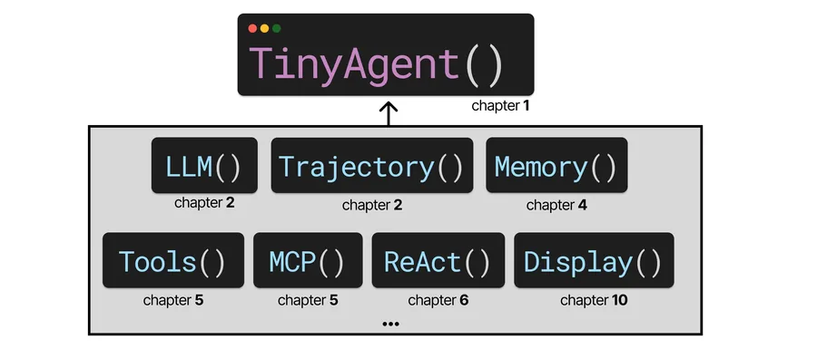

# Figures

The book contains more than 300 figures, every one of them drawn for it. This
page collects a sample; the rest live in the chapters where they belong.

!!! note "Work in progress"

    This gallery currently shows the figures already published in the book's
    open repository. It will grow as more are cleared for release.

## The shape of an agent

<figure markdown>
  { .plate }
  <figcaption>The architecture the whole book builds toward, with the chapter that introduces each piece.</figcaption>
</figure>

<figure markdown>
  { .plate }
  <figcaption>Anatomy of an agent.</figcaption>
</figure>

<figure markdown>
  { .plate }
  <figcaption>How language models became agents.</figcaption>
</figure>

## Tools and MCP

<figure markdown>
  { .plate }
  <figcaption>A tool definition, and the call that comes back.</figcaption>
</figure>

<figure markdown>
  { .plate }
  <figcaption>The MCP client.</figcaption>
</figure>

<figure markdown>
  { .plate }
  <figcaption>The MCP server.</figcaption>
</figure>

## Teaching devices

<figure markdown>
  { .plate }
  <figcaption>Code annotated where it sits, so the idea and the implementation stay together.</figcaption>
</figure>

<figure markdown>
  { .plate }
  <figcaption>Changes shown as diffs, the way you would read a pull request.</figcaption>
</figure>

<figure markdown>
  { .plate }
  <figcaption>Every module, and the chapter it arrives in.</figcaption>
</figure>
