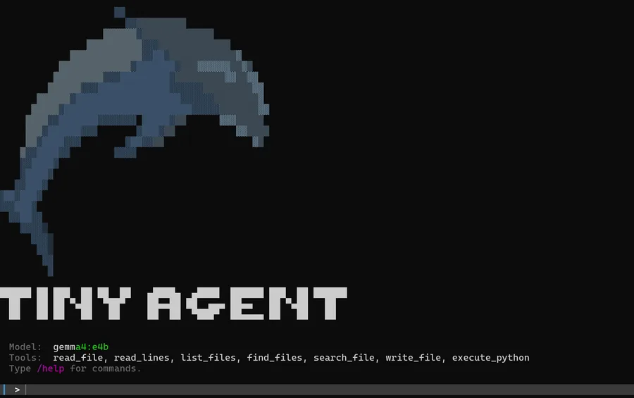

# Setup

The book builds `TinyAgent` in pure Python. You need two things: somewhere to
run notebooks, and a language model behind an OpenAI-compatible endpoint.
Everything else is the standard library.

## Somewhere to run the notebooks

=== "Google Colab"

    The shortest path. Every notebook in the book runs on Colab's free T4 —
    click the badge on any [chapter page](../book/index.md) and it opens ready
    to run. Nothing to install.

=== "Jupyter Lab, locally"

    If you would rather keep everything on your own machine:

    ```bash
    uv run jupyter lab
    ```

    or, with a plain Python environment:

    ```bash
    jupyter lab
    ```

## Installing the package

=== "uv (recommended)"

    [`uv`](https://docs.astral.sh/uv/getting-started/installation/) is the
    authors' preferred way to manage environments.

    ```bash
    # For the notebook tutorials
    uv add illustrated-agents --extra jupyter
    ```

    ```bash
    # For the TinyAgent CLI only
    uv add illustrated-agents
    ```

    If you cloned the book's repository instead:

    ```bash
    uv sync --extra jupyter
    ```

=== "pip"

    With an existing Python environment:

    ```bash
    pip install illustrated-agents[jupyter]
    ```

    ```bash
    # The TinyAgent CLI
    pip install illustrated-agents[terminal]
    ```

    Or straight from the repository:

    ```bash
    pip install git+https://github.com/HandsOnLLM/An-Illustrated-Guide-To-AI-Agents.git
    ```

## The TinyAgent CLI

To use the coding agent from chapter 10 as a real terminal tool:

```bash
uv tool install illustrated-agents[cli]
```

Then, from anywhere:

```bash
tinyagent
```

<figure markdown>
  
  <figcaption>What you should see.</figcaption>
</figure>

## A language model

The examples assume an OpenAI-compatible endpoint. That can be a hosted API or
something running on your own hardware — the book covers Ollama, LM Studio and
`llama.cpp` among others, and the code does not care which you pick.

Dependencies beyond that (MCP, for instance) are optional bonus content and
are called out where they appear.

## Optional extras

| Extra | Installs | For |
| --- | --- | --- |
| `jupyter` | JupyterLab, ipywidgets, rich, openai, mcp | Working through the notebooks |
| `terminal` | rich | The `tinyagent` CLI |
| `mcp` | mcp, nest_asyncio | The Model Context Protocol examples in chapter 5 |
| `all` | everything above | Not having to think about it |

## Trouble?

The book's repository is the place to raise anything that does not work:
[open an issue](https://github.com/HandsOnLLM/An-Illustrated-Guide-To-AI-Agents/issues).
